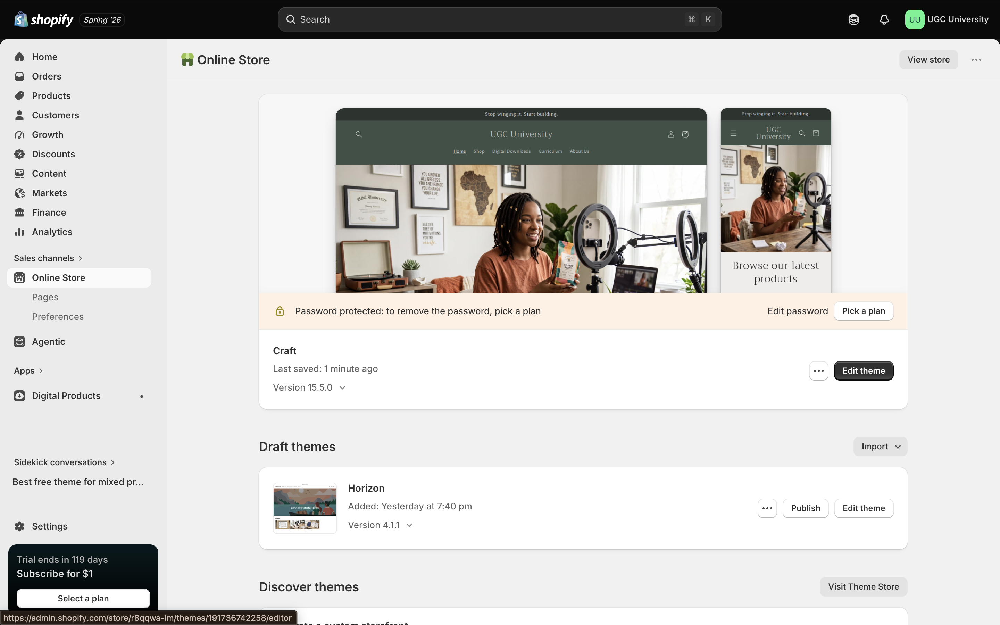
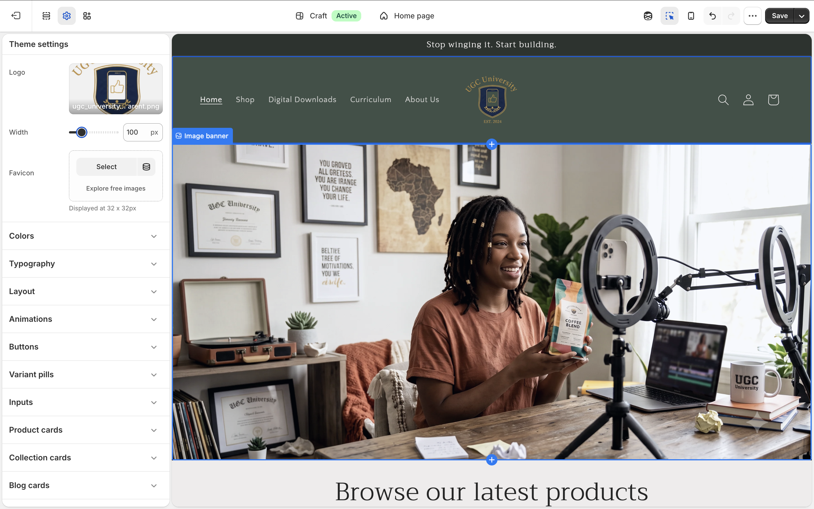
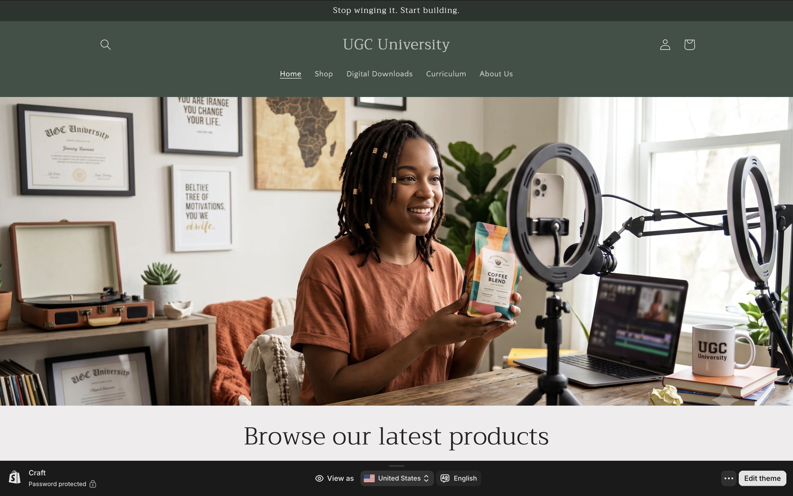
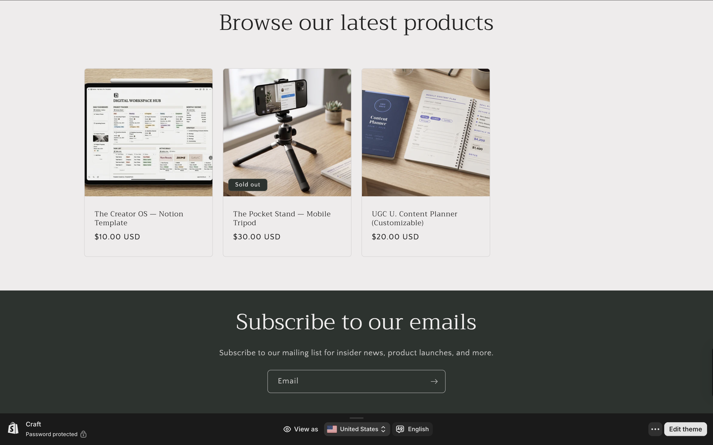

# 🛍️ **Store Name & Concept** {.unnumbered}

## **Store Name: UGC University** {.unnumbered}

UGC University is a digital store front that caters to digital content creators in need of tools and systems to grow their platforms. Target audience includes not only new and seasoned content creators, but one-stop shopping for small business owners to amplify their brand reach. In addition to providing (physical & digital) systems to plan content, track income, expenses, and deal pipelines, UGC University is an ecosystem from which production equipment tailored for mobile content creation can be purchased in one place. Digital products will include guides and speaker events intended to inform and inspire new and established creators alike.

# 🎯 **Target Customer** {.unnumbered} 

The ideal customer is an entrepreneur interested in content creation for social media based advertising and brand building. This could be either a user generated content creator providing B2B services or a small business owner promoting their product or service.

At the center of the UGC University customer base is a new kind of entrepreneur: one who builds brands through screens, stories, and strategy. These people are creative pro-sumers who not only highly active across social platforms and spend a significant amount of time studying brand and ad strategy, but also see the value in investing in knowledge and tools to grow their skillset, audience reach, and subsequent revenue. This demographic is subject to influence from the creator economy industry and will explore coaching opportunities based on the recommendation of their peers and the creators whose trajectory they admire.

# 🗒️ **Product Category Plan** {.unnumbered} 

1.  **The Planner Collection**

    This will be the hero category, utilizing Shopify's print-on-demand integration. This is a physical content planner complete with accessories like sticker sheets or refill pages. There will also be a Notion template and digital pdf for iPad users or those who need a more cost effective, printable option.

2.  **Studio & On-the-Go Essentials**

    Dropshipped gear curated for mobile shooting, such as tripods, ring lights, phone mounts, backdrops, microphones and lighting kits. These are core tools every UGC creator needs to produce content, but will based on industry recommendations, reducing the need for extensive research.

3.  **Digital Downloads**

    Shot list templates, digital portfolio templates, media kit templates, brand pitch decks, UGC creator-specific Notion templates. These are purely digital products with no fulfillment cost, but high margin.

# 💻 **Initial Shopify Setup Evidence** {.unnumbered}

##  Shopify Admin Area {.unnumbered}

## Selected Theme {.unnumbered}

## Homepage Draft {.unnumbered}

# 🐎 **Connection to CPP Farm Store** {.unnumbered} 

Write one paragraph explaining how your store concept or setup decisions could help you think about the CPP Farm Store consulting project.

# **Appendix** {.unnumbered}

-   [GitHub Repo](https://github.com/lewiswaddell/ITP-W04.git)

-   [GitHub Page](https://lewiswaddell.github.io/ITP-W04/)
